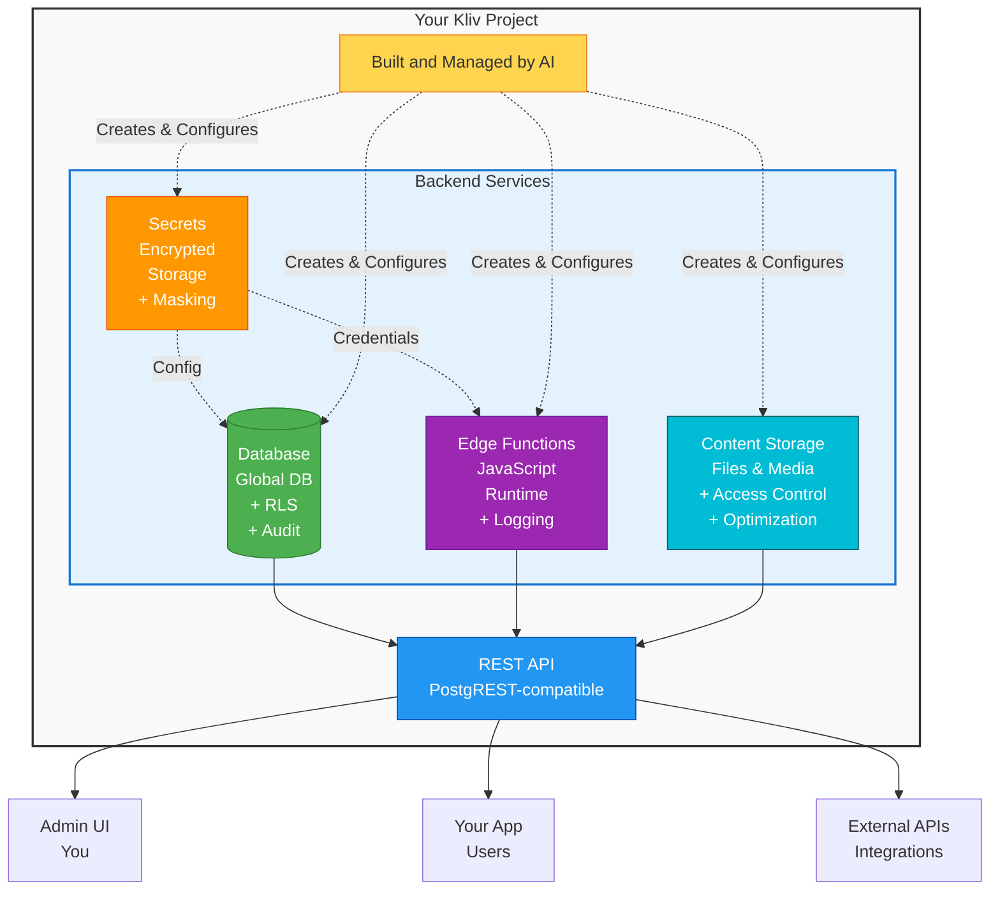

# Kliv Cloud

Kliv Cloud provides a complete backend for your applications, automatically built and managed by your AI assistant. When you describe what your app needs, the AI sets up a secure database, creates server-side functions, manages API credentials, and configures access control — all without you writing a single line of code.

Your backend runs on enterprise-grade infrastructure with globally replicated databases, row-level security, automatic audit trails, and encrypted secrets storage. Everything is accessible through a visual admin interface where you can view your data, monitor functions, and manage your project.

## What's Included

### Database
Store your application data with automatic security, backups, and audit trails. The AI creates tables, configures relationships, and manages all technical details.

[Learn about Database →](/cloud/database)

### Content Storage
Upload and manage files like images, documents, and videos with automatic optimization and access control. Perfect for user avatars, file sharing, and image galleries.

[Learn about Content Storage →](/cloud/content-storage)

### Secrets Management
Securely store API credentials and sensitive configuration. Secrets are encrypted, masked in the UI, and automatically available to your functions.

[Learn about Secrets →](/cloud/secrets)

### Edge Functions
Server-side JavaScript for complex logic, external API integration, and secure operations. The AI writes the code based on your description.

[Learn about Edge Functions →](/cloud/functions)

### Admin Interface
Visual tools to browse data, monitor functions, check logs, and manage your backend without writing code.

[Learn about Admin Interface →](/cloud/admin)

### Email Delivery
Send transactional emails, notifications, and marketing messages with template management and custom SMTP support.

[Learn about Email Delivery →](/cloud/email-delivery)

### Email Templates
Create reusable email templates with Markdown formatting and dynamic variables for personalized messaging.

[Learn about Email Templates →](/cloud/email-templates)

---

## Architecture Overview

---

## Getting Started

### Creating Your First Application

**1. Describe what you want to build**

Tell the AI about your application in natural language. For example: "Create a blog where users can write posts with titles and content. Posts should be public to read but only the author can edit them."

The AI will create the necessary database tables, configure appropriate security rules, and set up any needed functions.

**2. View your data**

Open the admin interface and navigate to the Database section. You'll see the tables the AI created. Click on a table to browse its structure and any data it contains.

**3. Add test data**

You can add records through the admin interface to test your application, or ask the AI to populate it with sample data.

**4. Build features**

As you describe additional features, the AI will create more tables, functions, and integrations. It handles all the backend complexity automatically.

**5. Monitor and refine**

Use the admin interface to monitor function calls, view logs, check data, and understand how your application is being used. You can refine features by talking to the AI.

---

## Summary

Kliv Cloud provides everything you need to build a complete application backend without writing server-side code:

**Automated Database**: The AI creates tables, sets up relationships, configures security, and handles all the technical complexity. Your data is stored securely with automatic backups and audit trails.

**Secrets Management**: Store API credentials and sensitive configuration safely. Secrets are encrypted, masked in the UI, and automatically available to your server-side functions.

**Edge Functions**: The AI writes server-side JavaScript for features like form processing, external API integration, and complex business logic. All functions are logged and monitored.

**Visual Administration**: Manage everything through an intuitive interface. Browse data, monitor functions, check logs, and configure settings without technical knowledge.

**Email System**: Send emails with template management, custom SMTP support, and automatic rate limiting. Templates use Markdown for easy formatting with dynamic variables for personalization.

Just describe what you want to build, and the AI handles the implementation while maintaining security, performance, and best practices throughout.
