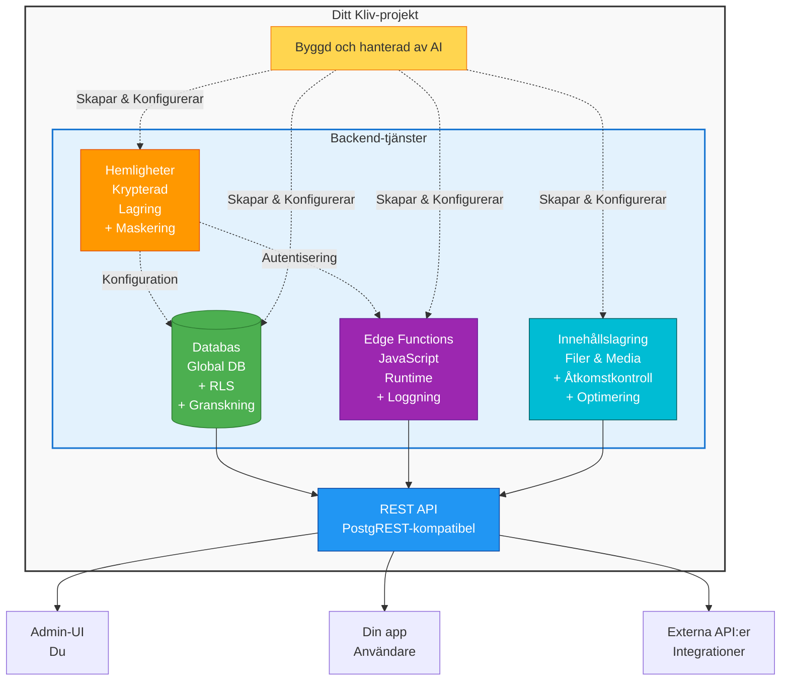

# Kliv Cloud

Kliv Cloud tillhandahåller en komplett backend för dina applikationer, automatiskt byggd och hanterad av din AI-assistent. När du beskriver vad din app behöver sätter AI upp en säker databas, skapar serverbaserade funktioner, hanterar API-autentiseringsuppgifter och konfigurerar åtkomstkontroll — allt utan att du skriver en enda rad kod.

Din backend körs på infrastruktur av företagsklass med globalt replikerade databaser, säkerhet på radnivå, automatiska granskningsspår och krypterad hemlighetslagring. Allt är tillgängligt genom ett visuellt administrationsgränssnitt där du kan visa dina data, övervaka funktioner och hantera ditt projekt.

## Vad Ingår

### Databas
Lagra din applikationsdata med automatisk säkerhet, säkerhetskopior och granskningsspår. AI skapar tabeller, konfigurerar relationer och hanterar alla tekniska detaljer.

[Läs mer om Databas →](/sv/cloud/database)

### Innehållslagring
Lagra användaruppladdade filer som bilder, dokument, PDF-filer och videor. Inkluderar automatisk bildoptimering, åtkomstkontroll och edge-funktionsintegration.

[Läs mer om Innehållslagring →](/sv/cloud/content-storage)

### Hemlighetshantering
Lagra API-autentiseringsuppgifter och känslig konfiguration säkert. Hemligheter krypteras, maskeras i gränssnittet och är automatiskt tillgängliga för dina funktioner.

[Läs mer om Hemlighetshantering →](/sv/cloud/secrets)

### Edge Functions
Serverbaserad JavaScript för komplex logik, extern API-integration och säkra operationer. AI skriver koden baserat på din beskrivning.

[Läs mer om Edge Functions →](/sv/cloud/functions)

### Administrationsgränssnitt
Visuella verktyg för att bläddra i data, övervaka funktioner, kontrollera loggar och hantera din backend utan att skriva kod.

[Läs mer om Administrationsgränssnitt →](/sv/cloud/admin)

### E-postleverans
Skicka transaktionsmail, notifieringar och marknadsföringsmeddelanden med mallhantering och anpassat SMTP-stöd.

[Läs mer om E-postleverans →](/sv/cloud/email-delivery)

### E-postmallar
Skapa återanvändbara e-postmallar med Markdown-formatering och dynamiska variabler för personaliserade meddelanden.

[Läs mer om E-postmallar →](/sv/cloud/email-templates)

---

## Arkitekturöversikt

---

## Kom Igång

### Skapa Din Första Applikation

**1. Beskriv vad du vill bygga**

Berätta för AI om din applikation på naturligt språk. Till exempel: "Skapa en blogg där användare kan skriva inlägg med titlar och innehåll. Inlägg ska vara publika att läsa men bara författaren kan redigera dem."

AI kommer att skapa nödvändiga databastabeller, konfigurera lämpliga säkerhetsregler och sätta upp eventuella behövda funktioner.

**2. Visa dina data**

Öppna administrationsgränssnittet och navigera till databassektionen. Du kommer att se tabellerna som AI skapade. Klicka på en tabell för att bläddra i dess struktur och eventuell data den innehåller.

**3. Lägg till testdata**

Du kan lägga till poster genom administrationsgränssnittet för att testa din applikation, eller be AI att fylla den med exempeldata.

**4. Bygg funktioner**

När du beskriver ytterligare funktioner kommer AI att skapa fler tabeller, funktioner och integrationer. Den hanterar all backend-komplexitet automatiskt.

**5. Övervaka och förfina**

Använd administrationsgränssnittet för att övervaka funktionsanrop, visa loggar, kontrollera data och förstå hur din applikation används. Du kan förfina funktioner genom att prata med AI.

---

## Sammanfattning

Kliv Cloud tillhandahåller allt du behöver för att bygga en komplett applikationsbackend utan att skriva serverkod:

**Automatiserad Databas**: AI skapar tabeller, sätter upp relationer, konfigurerar säkerhet och hanterar all teknisk komplexitet. Din data lagras säkert med automatiska säkerhetskopior och granskningsspår.

**Hemlighetshantering**: Lagra API-autentiseringsuppgifter och känslig konfiguration säkert. Hemligheter krypteras, maskeras i gränssnittet och är automatiskt tillgängliga för dina serverbaserade funktioner.

**Edge Functions**: AI skriver serverbaserad JavaScript för funktioner som formulärbehandling, extern API-integration och komplex affärslogik. Alla funktioner loggas och övervakas.

**Visuell Administration**: Hantera allt genom ett intuitivt gränssnitt. Bläddra i data, övervaka funktioner, kontrollera loggar och konfigurera inställningar utan teknisk kunskap.

**E-postsystem**: Skicka e-post med mallhantering, anpassat SMTP-stöd och automatisk hastighetsbegränsning. Mallar använder Markdown för enkel formatering med dynamiska variabler för personalisering.

Beskriv bara vad du vill bygga, och AI hanterar implementationen samtidigt som säkerhet, prestanda och bästa praxis upprätthålls genomgående.
